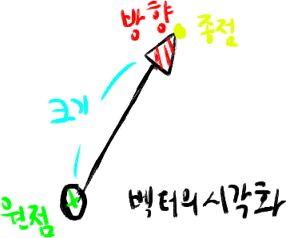

아르고님한테 받은 책중 `좋은 게임을 만드는 핵심원리 게임수학과물리책`을 나눔받았다.

얼른 보고 메타몽님한테 택배로 보내주기

# 책의 주요특성

게임프로그래밍에 필요한 가장 기초적인 수학과 물리를 다룬다

# 1.벡터

힘, 모멘트(회전력), 변위, 속도, 가속도  
크기와 방향을 갖는 물리적 요소들을 수학적으로 표현하기 위해서 벡터라는 개념을 도입  
벡터란 크기와 방향을 나타내는 수학적인 도구이다  

화살표의 길이가 벡터의 크기를 표현.  
화살표의 머리가 방향을 나타냄  

## 스칼라
크기만 나타낼때는 스칼라(Scalar)
스칼라는 크기 or 값만 표시할때 사용
벡터를 설명할떄  언급한 크기라는것자체가 스칼라

### 동등벡터 
각각의 벡터가 시작점은 다르지만 크기오하 방향이 모두같은 벡터

## 벡터 == [Vx, Vy] == 2차원백터

(2차원, 3차원동일)
가고하자 하는방향 = 상대방위치벡터 - 자기자신위치벡터

## 벡터의 크기와 단위벡터

### 벡터
||V|| == 벡터의 크기라는 기호. 노옴(Norm)
삼각형으로 보면 빗변이 벡터의 크기or길이 (피타고라스)
루트 == 제곱근

#### 2차원
벡터의 크기or길이 = 루트(넓이제곱 + 높이제곱) == ||V|| = Sqrt(Pow(x,2), Pow(y,2))

#### 3차원
벡터의 크기or길이 = 루트(좌우 + 위아래, 전후방) == ||V|| = Sqrt(Pow(x,2), Pow(y,2), Pow(z,2))

### 단위벡터
단위벡터 == 방향만을 나타내는 벡터

벡터 == 크기와 방향을 갖는 요소

단위벡터는 이름에서 볼수 있듯이 크기는 단위, 즉 1이다.  
U가 단위벡터라고 다음과 같은 말이된다

1 = sqrt(pow(Ux,2), pow(Uy,2))

크기가 1인 벡터는 방향ㅇ르 표현하는데 융용하게 쓰이며 컴퓨터 그래픽스에서 광원의 방향, 
평면의 법선 방향, 카메라의 방향등 방향을 나타낼떄 사용된다.

크기가 1이 아닌 벡터를 단위벡터로 만들어주는걸 `정규화(Normalization)`라고 하며,
벡터를 자신의 크기로 나누어 줌으로 써얻을수 있다.

vector V = new vector(x,y);

U = V/||V|| ==  (1 / sqrt(pow(Vx,2),pow(Vy,2))) * V

#### 반대
V =  ||V|| U = (sqrt(pow(vx,2),pow(vy,2)))*U

## 정규화과정은 매번 이해가 잘안되네

### 길이처리
float sqrt(x*x + y*y + z*z);

### 단위처리
float length = GetLength();
vector (x/ length, y/length, z/length);

### 벡터의 곱셈은 두종류
#### 내적(스칼라(Scalar))

결과값이 스칼라, 스칼라곱(Scalar Product) or 점곱(DotProduct) 이라고 부름  
내적은 벡터의 방향관계를 얻는 도구로 사용되기떄문에 컴퓨터 그래픽스에서 매우 빈번히 사용됨.

#### 각벡터의 성분간의 곲을 모두 더한 스칼라값이 벡터A,B의 내적이다.

벡터A = B가 같으면 0 이 나오므로 Cos(delta) = 1 이 나옴
0~180
A * B == (||A|| ||B||)cos(delta)

(0제곱은 1이 나옴)
Why => 
3 * 0 == 0 => 구할수 없음
3 * 1 == 3
3 * 2 == 9

3(0) == 1
3(1) == 3
3(2) == 9

## 내적응용
1) 방향
A가 자기자신의 방향(고정), B가 상대방의 위치(움직임)를 내적하면

1 == 전방  
0 == 수직  
-1 == 후방  

2) 벡터의 투영
하나의 벡터A를 두개의 단위벡터성분으로 분해하든지 
다른벡터 B로 투명해야할필요가 생기곤한다.

하나의 벡터를 두개의 단위벡터성분으로 분해하는 개념을 설명하고 있다.

벡터A와 단위벡터i,j 간에 각각 내적을 취하여 각방향으로 분해된 벡터의 크기를 
구한후 단위벡터를 곱해주면된다.  
(뭔뜻이여)

#### 외적(Cross)
벡터의 외적은 벡터곱셈의 또 다른 형태다. 벡터의 내적이 두벡터간의 사이값 관계를  
나타내는 스칼라임에 비해 벡터의 외적은 두벡터에 수직한 벡터의 결과값으로 갖음.
크로스곱(Cross Projuct)or 벡터곱(Vector Product)

교환법칙이 성립되지 않으므로 
A와 B의 순서에 주의해야됨

## 외적 응용
1) 표면의 법선벡터 계산
법선벡터(노말벡터) == 수직벡터
주로 평면이나 곡면등의 표면에 수직한 벡터를 법선벡터

법선 벡터를 설명할려면 접선벡터도 알아야된다. 
접선벡터는 어떤표면에 접한 벡터다. 

(그럼 무조건 세개의 정점이 필요하다)
점 A의 기준으로 점B,C에 대한 벡터를 각각 U, V.
접선벡터 U, V가 주어질떄 그 점에서 법선 벡터N은 U와V의 외적이다.
N = U * V

2) 삼각형의 면적계산
A * B (||A|| ||B|| sin(delta)) E
(E = A * B방향의 단위벡터)

법선벡터 N의 크기는 U와 V로 구성되는 평행사변형의 넓이(밑변 * 높이 = 넓이)

## 2. 행렬
행렬 : 벡터의 확장

행렬이란 2차원으로 배열된 순서 쌍을 말함
(1by1 2by1)
[a11 a12 a13 a14]  
[a21 a22 a23 a24]  
[a31 a32 a33 a34]  
[a41 a42 a43 a44]  

m행 n열  
개행, 열 == 렬

#### 정방행렬
행과 열의 수가 같은 행렬

#### 대각행렬, 단위행렬
대각행렬 i와 j가 같은 원소를 대각선 성분이라고 하는데
정방행렬중에서 와 같이 대각선을 제외한 모든성분이 0인 특별한 형태
[a11 0 0  0]  
[0 a22 0  0]  
[0  0 a33 0]  
[0  0  0 a44]  

단위행렬은 여기서 대각선 성분의 값이 1로 모두가 같으면 이걸 단위행렬이라고 함  
[1 0 0 0]  
[0 1 0 0]  
[0 0 1 0]  
[0 0 0 1]  

#### 전치행렬
행을 열로 자리바꿈하거나 열을 행으로 자리바꿈한것.
A행렬이
[2 7 -4]  
[1 6 -1]  
이면 전치행렬일 경우
[2 1]
[7 6]
[-4 -1]

### 행렬 연산
#### 행렬덧셈
제약조건 == 더해지는 두행렬의 차원이 동일해야됨.
(m*n) + (m*n) => (m*n)
[1 2] + [1 2] = [2 4]
[3 4]	[3 4]	[6 8]

#### 행렬뺄셈
제약조건 == 더해지는 두행렬의 차원이 동일해야됨.
(m*n) - (m*n) => (m*n)
[1 2] - [1 2] = [0 0]
[3 4]	[3 4]	[0 0]

#### 행렬곱셈
행렬연산에서 자주사용되는것중 하나가 행렬의 곱셈

벡터의 내적 == 차원이 같아야 연산이 가능
행렬의 곱셉을 하기전에 왼쪽 행렬의 열의 수가 오른쪽 행렬의 수와 동일한지 체크하기
=> A와 B행렬의 열의 수가 동일한지체크
(m*n) - (n*p) => (m*p) (곱셈을 하기전에 행렬 A B기 같은지 확인하는 것)
(2*3) - (3*2) = 2*2 => `안쪽부분이 같은지 체크하기가 관건`
[1 2 3] * [1 2] =
[3 4 5]	  [3 4]	
		  [3 5]
[1+6+9 2+8+15]
[3+12+15 6+16+25]

[16 25]
[30 47]

#### 행렬과 스칼라와 곱
벡터에 스칼라를 곱한적이 있었다. 이때 벡터의 각 성분에 스칼라값을 
곱하는것으로 그결과가 표시됫는데
=> vector(2,3) * 2 == vector(4,6)

행렬역시 이와 비슷하게 됨
k = 스칼라

a = [1 2]
	[3 4]

3a = [3 6]
	 [9 12]

#### 행렬의 연산법칙
A,B,C 행렬
I 단위행렬
0 영행렬
K, I는 스칼라

※주의해야될건 곱셈의 첫번쨰 규칙이다.

#### 행렬식

## 3. 변환

## 4. 사원수

## 5. 기하학

## 6. 카매라

## 7. 조명

## 8. 고급랜더링

## 9. 가시성판단

## 10. 다각형기법

## 11. 운동학

## 12. 동력학

## 13. 발사체

## 14. 길찾기